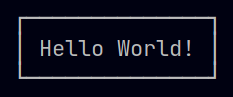
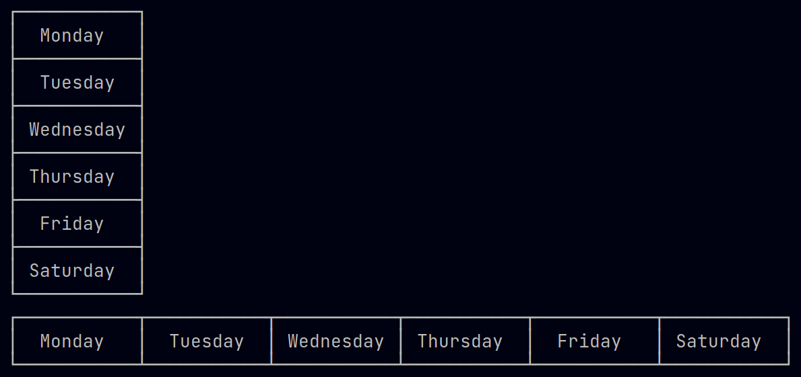
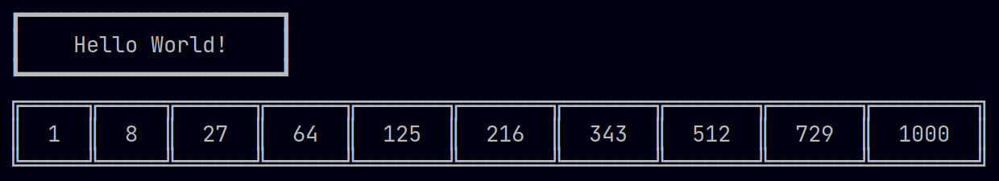
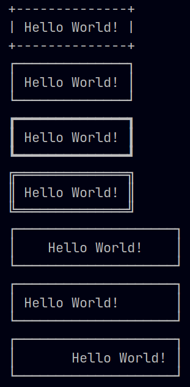
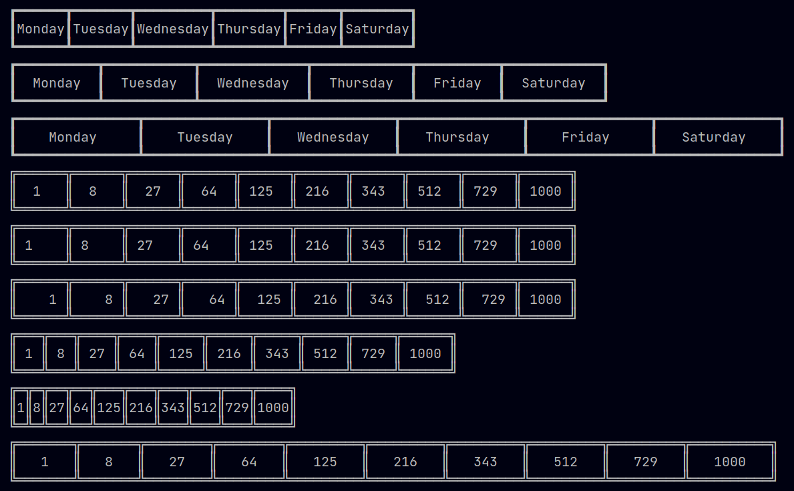
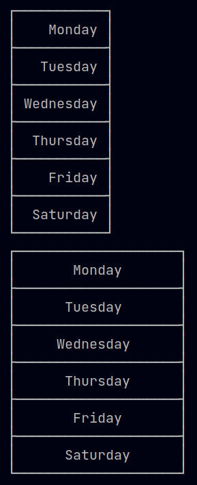

# Boxes for Kotlin

String and Collection class extension functions to help with adding boxes around text / lists. Created for students in my coding classes to use.

## Installation

Just add **Box.kt** to your project and you should be good to go.

(Main.kt includes a ```boxesTest()``` function that demonstrates most of the features.)

## Usage

### Strings

Simply call the function ```.box()``` on any String text to generate a printable String



### Collections

You can use either ```.row()``` (horizontal) or ```.column()``` (vertical) to generate a printable String for any Collection



### Options

Optionally, the following parameters can be used to customise the output:

- **style** - TEXT_BORDER, THIN_BORDER (default), THICK_BORDER, or DOUBLE_BORDER
- **align** - LEFT_ALIGN, CENTRE_ALIGN/CENTER_ALIGN (default), or RIGHT_ALIGN
- **padding** - Additional spaces to the left/right of values (default 1)
- **width** - A fixed number of characters within the box / cell (will be over-ridden if contents do not fit), or FIT_WIDTH (String default) to fit to contents (not applicable to Collection columns), or MAX_WIDTH (Collection default) to fit to longest item

e.g. This code:

```kotlin
"Hello World!".box(style = Box.THICK_BORDER,
                   width = 20)

numbers.row(style = Box.DOUBLE_BORDER,
            width = Box.FIT_WIDTH,
            padding = 2)
```

would give this output...



Other examples of Strings...



Other example of Collections...





